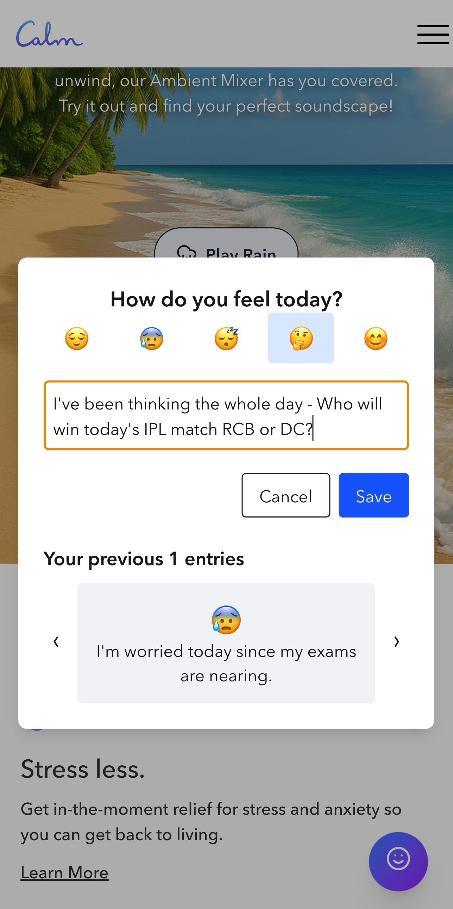

# pixel-plus-deepak-calm
A pixel-perfect clone of Calm’s homepage built for the Pixel Plus Hackathon using Next.js.

[Live Demo](https://pixel-plus-deepak-calm.vercel.app/) · [Original Site](https://www.calm.com/)  

---

## Table of Contents
- [About](#about)  
- [Features](#features)  
  - [1. Guided Breathing](#1-guided-breathing)  
  - [2. Ambient Sound Mixer](#2-ambient-sound-mixer)  
  - [3. Mood Tracker](#3-mood-tracker)  
- [Before & After](#before--after)  
- [Getting Started](#getting-started)  
- [Tech Stack](#tech-stack)  
- [License](#license)  
- [Contact](#contact)  

---

## About
This **Next.js** project recreates Calm’s homepage with pixel-perfect fidelity.  
No backend or external APIs—just a fully server-rendered, interactive front end.  

---

## Features
Beyond the original design, I’ve added **three** bonus features to showcase interactivity, animations, and state persistence:

### 1. Guided Breathing
**“Take a Deep Breath Now”**  
A pulsing gradient circle guides you through inhale, hold, and exhale cycles—perfect for a quick pause in your day.  


---

### 2. Ambient Sound Mixer
**“Start Mixing Your Calm Now”**  
Blend rain, ocean waves, and white noise to create a personalized soundscape for focus, relaxation, or sleep.  


---

### 3. Mood Tracker
**“How do you feel?”**  
Open the modal, pick an emoji, jot a 140-char note, and review your last five entries in a smooth carousel—data lives in `localStorage`.  



---

## Before & After
| Original Calm.com | My Clone |
| :------: | :------: |
|  |  |
|  |  |

---

## Getting Started
Clone and install dependencies:

```bash
git clone https://github.com/deepakkj/pixel-plus-deepak-calm.git
cd pixel-plus-deepak-calm
npm install

Then, run the development server:

bash
npm run dev
# or
yarn dev
# or
pnpm dev
# or
bun dev


Open [http://localhost:3000](http://localhost:3000) with your browser to see the result.

You can start editing the page by modifying app/page.js. The page auto-updates as you edit the file.
This project uses [next/font](https://nextjs.org/docs/app/building-your-application/optimizing/fonts) to automatically optimize and load [Geist](https://vercel.com/font), a new font family for Vercel.
```

## Tech Stack
React Js
Next Js
SCSS
Tailwind CSS
Vercel for hosting the app

## License
MIT License

## Contact Details
You can reach me at my email at [Deepak Kumar Jain](mailto:deepakkumarjain21@gmail.com)
